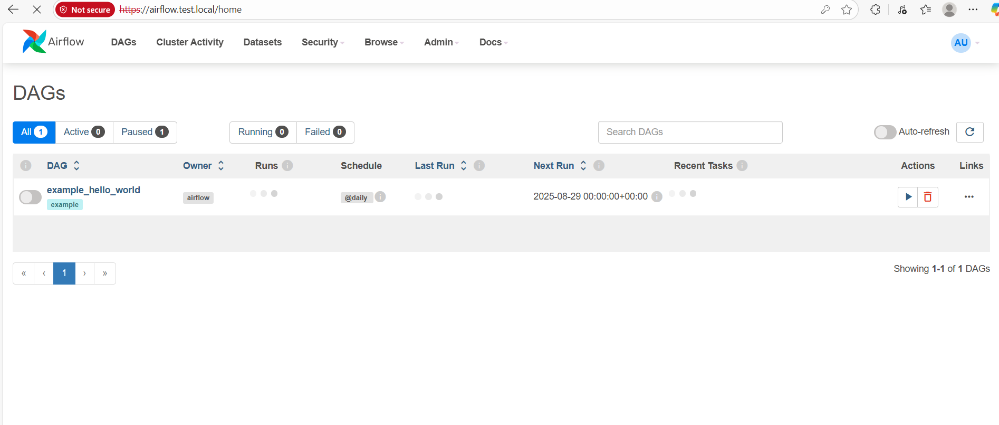
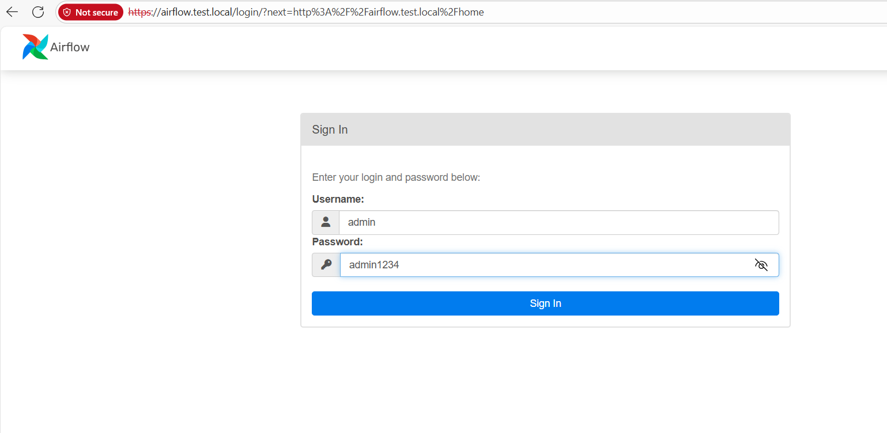

# 🚁 Airflow + PostgreSQL + Nginx (Docker Compose)

ระบบจัดการเวิร์กโฟลว์ **Apache Airflow** ที่พร้อมใช้งานในระดับ Production ประกอบด้วย:

- 🗄️ **PostgreSQL** - ฐานข้อมูลสำหรับเก็บ Metadata ของ Airflow
- 🔧 **Airflow (LocalExecutor)** - ตัวจัดการเวิร์กโฟลว์หลัก
- ⏰ **Airflow Scheduler** - ตัวจัดตารางเวลาการทำงาน
- 🌐 **Nginx** - Reverse Proxy พร้อมรองรับ SSL
- 📦 **Custom Python Packages** - ติดตั้งผ่าน `requirements.txt` (`psycopg2-binary`, `pandas`, `requests`)

---
## 🆘 การแก้ไขปัญหาเบื้องต้น

### ปัญหาที่พบบ่อย:
1. **ไม่สามารถเข้า airflow.test.local ได้**
   - เพิ่ม `127.0.0.1 airflow.test.local` ในไฟล์ `/etc/hosts` (Linux/Mac) หรือ `C:\Windows\System32\drivers\etc\hosts` (Windows)

2. **PostgreSQL ไม่ทำงาน**
   - ตรวจสอบว่าพอร์ต 5432 ว่างอยู่
   - รัน: `docker compose logs postgres`

3. **Airflow ทำงานช้า**
   - ตรวจสอบ Resource ของระบบ
   - ปรับค่า `AIRFLOW__CORE__PARALLELISM` ตามต้องการ

---


ระบบมีโครงสร้างการทำงานดังนี้:

### 📂 โครงสร้างไฟล์
```
airflow-docker/
├── dags/              # ไฟล์ DAG สำหรับ Airflow
├── logs/              # ไฟล์ Log ระบบ
├── plugins/           # Plugin เพิ่มเติม
├── nginx/
│   └── cert/          # SSL Certificate
├── requirements.txt   # Python Dependencies
└── docker-compose.yaml
```

### 🔄 การทำงานหลัก
- **ไฟล์หลัก**: `exam_dag.py` - ไฟล์ DAG ตัวอย่าง
- **การเก็บ Log**: ระบบจะเก็บ Log ทั้งหมดในโฟลเดอร์ `logs/`
- **Volume Mapping**: ไฟล์ใน folder dags logs nginx plugins จะถูกแมปออกมาด้านนอก

---

## 🐳 คำอธิบาย Docker Services

ระบบประกอบด้วย 5 Services หลัก:

### 1. 🗄️ **postgres**
- **หน้าที่**: ฐานข้อมูลหลักสำหรับเก็บ Metadata ของ Airflow
- **การใช้งาน**: เก็บข้อมูล DAG, Task Instance, และการตั้งค่าต่างๆ

### 2. 🚀 **airflow-init**
- **หน้าที่**: เริ่มต้นระบบและสร้าง User สำหรับเข้าใช้งาน
- **การทำงาน**: รัน Bash Script เพื่อติดตั้งและตั้งค่าเบื้องต้น แล้ว connect postgres ผ่าน service  postgres
- **เงื่อนไข**: รอให้ PostgreSQL Service พร้อมใช้งานก่อน

### 3. 🌐 **airflow-webserver**
- **หน้าที่**: Web Interface สำหรับจัดการ Airflow  connect postgres ผ่าน service  postgres
- **พอร์ต**: 8080
- **เงื่อนไข**: รอให้ airflow-init ทำงานเสร็จสิ้นก่อน

### 4. ⏰ **airflow-scheduler**
- **หน้าที่**: จัดการตารางเวลาการทำงานของ DAG
- **การทำงาน**: ตรวจสอบและกำหนดเวลาการทำงานของ Task ต่างๆ connect postgres ผ่าน service  postgres
- **เงื่อนไข**: ทำงานหลังจาก airflow-init เสร็จสิ้น

### 5. 🔒 **nginx**
- **หน้าที่**: Reverse Proxy และจัดการ SSL
- **พอร์ต**: 80 (HTTP), 443 (HTTPS)
- **โดเมน**: `airflow.test.local`
- **การทำงาน**: 
  - เมื่อเข้า `airflow.test.local` จะ redirect ไปยัง HTTPS (Port 443)
  - ใช้ SSL Certificate จากโฟลเดอร์ `nginx/cert/`
  - เนื่องจากเป็น Self-signed Certificate จึงจะแสดงคำเตือนความปลอดภัย



---

## 🚀 วิธีการเริ่มใช้งาน

### 1. 📥 ดาวน์โหลดโครงการ
```bash
git clone https://github.com/nutthapong224/airflow-docker.git
cd airflow-docker
```

### 2. 🔧 เริ่มต้นระบบ
```bash
docker compose up -d --build
```

### 3. 🌐 เข้าสู่ระบบ
- **URL**: `http://airflow.test.local` หรือ `https://airflow.test.local`
- **Username**: `admin`
- **Password**: `admin1234`



---

## 📋 ข้อมูลเพิ่มเติม

### 🔧 การกำหนดค่า
- **Executor**: LocalExecutor
- **ฐานข้อมูล**: PostgreSQL
- **Python Packages**: ดูรายละเอียดใน `requirements.txt`

### 📝 การพัฒนา DAG
- วางไฟล์ DAG ในโฟลเดอร์ `dags/`
- ระบบจะอัพเดต DAG อัตโนมัติ
- ตรวจสอบ Log ได้ในโฟลเดอร์ `logs/`

### 🔒 ความปลอดภัย
- รองรับ HTTPS ผ่าน Nginx
- ใช้ Self-signed Certificate (เหมาะสำหรับการทดสอบ)
- ตอนนี้ไม่มี CA เพราะว่า ไม่มีการจด domainจึงทำให้ https ถูก ขีดออก

### 🛠️ การบำรุงรักษา
- ตรวจสอบสถานะ Service: `docker compose ps`
- ดู Log ระบบ: `docker compose logs [service-name]`
- หยุดระบบ: `docker compose down`
- อัพเดตระบบ: `docker compose up -d --build`

---

